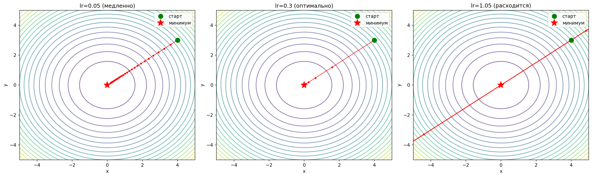
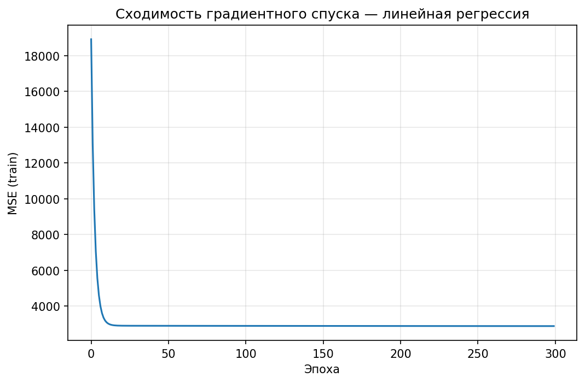
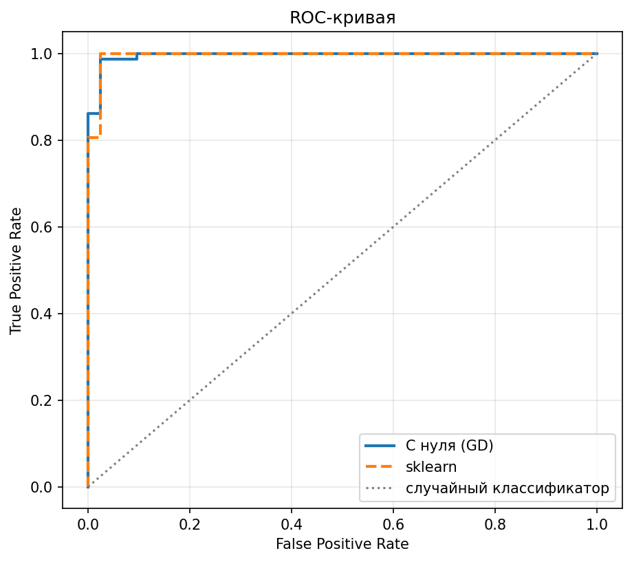
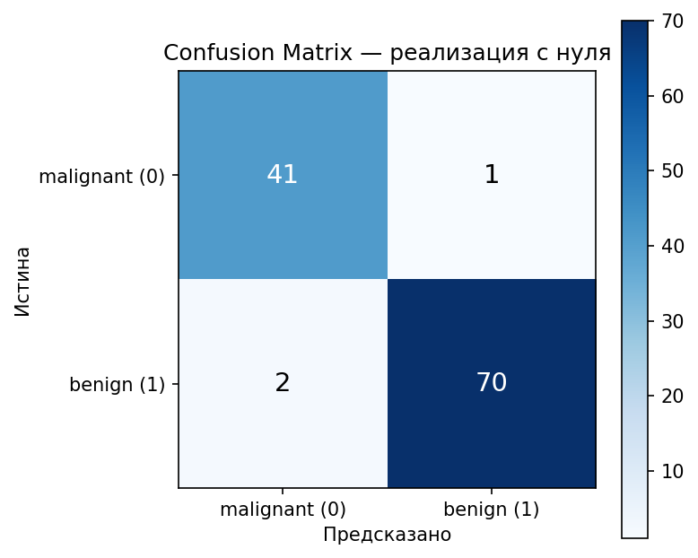
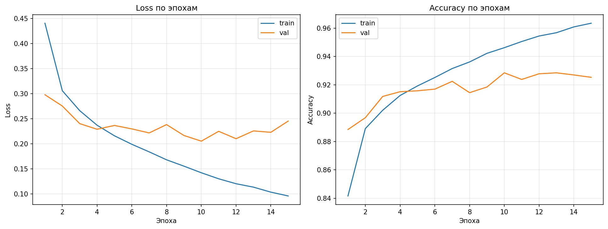
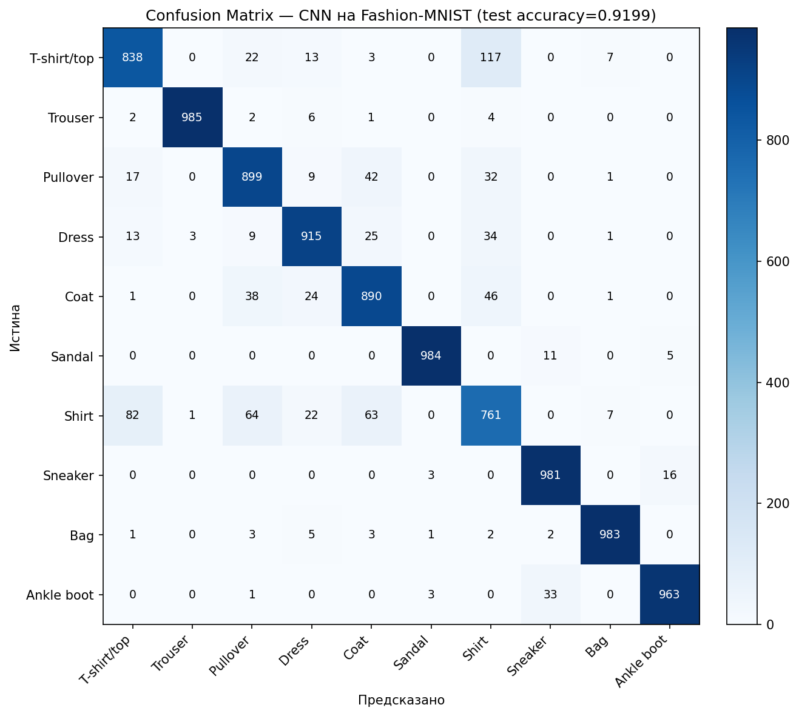
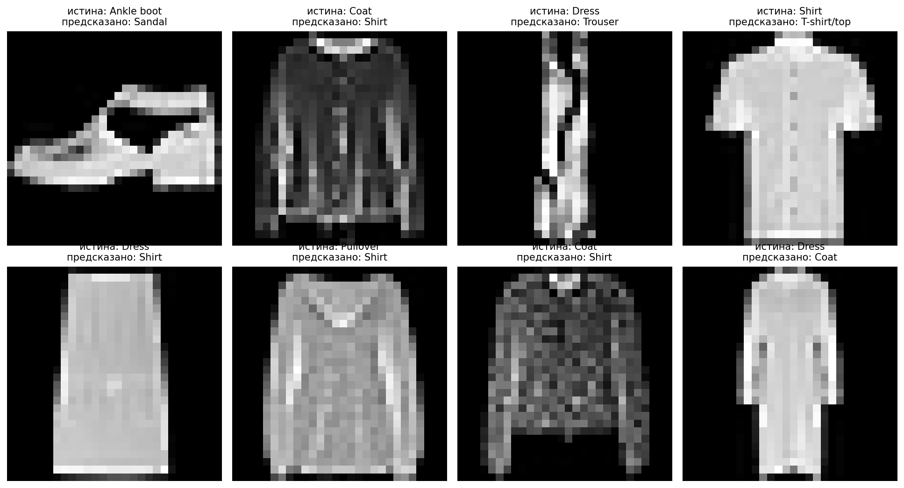

# ML from Scratch to PyTorch

Небольшой проект в двух частях: сначала реализую базовые ML-алгоритмы «с нуля» на NumPy,
чтобы разобраться в математике под капотом, потом — обучаю CNN на PyTorch на более
сложной задаче. Идея не в том, чтобы придумать что-то новое, а в том, чтобы явно показать
понимание того, что происходит внутри `model.fit()`, прежде чем полагаться на готовые библиотеки.

## Структура репозитория

```
ml-from-scratch-to-pytorch/
├── src/
│   ├── part1_from_scratch/     # градиентный спуск, лин. и лог. регрессия на NumPy
│   └── part2_pytorch/          # CNN на PyTorch (Fashion-MNIST)
├── notebooks/                  # эксперименты и визуализации
├── results/                    # сохранённые графики
└── requirements.txt
```

---

## Часть 1. Градиентный спуск, линейная и логистическая регрессия с нуля

Реализация в `src/part1_from_scratch/`:
- `gradient_descent.py` — универсальный движок GD (batch / mini-batch / SGD)
- `linear_regression.py` — линейная регрессия (MSE-loss) поверх этого движка
- `logistic_regression.py` — логистическая регрессия (BCE-loss) поверх этого движка

Каждый алгоритм сравнивается с соответствующей моделью из `scikit-learn` на реальных
датасетах, чтобы показать, что реализация действительно работает, а не просто существует.

### 1.1. Демонстрация градиентного спуска

Траектория спуска к минимуму функции `f(x, y) = x² + y²` при разных learning rate:



| Learning rate | Результат |
|---|---|
| 0.05 | сходится медленно, за 30 шагов не доходит до минимума |
| 0.3 | сходится быстро и стабильно |
| 1.05 | расходится — шаги перепрыгивают минимум |

Это наглядно показывает, почему выбор `lr` — не формальность, а то, что напрямую влияет
на сходимость.

### 1.2. Линейная регрессия (датасет Diabetes)

Обучил линейную регрессию через градиентный спуск и сравнил со `sklearn.LinearRegression`
(аналитическое решение через OLS).



| Метрика | С нуля (GD) | sklearn (OLS) |
|---|---|---|
| MSE (test) | 2887.50 | 2900.19 |

Разница в MSE — около 0.4%, что подтверждает: градиентный спуск сходится к решению,
практически эквивалентному аналитическому.

### 1.3. Логистическая регрессия (Breast Cancer Wisconsin)

Аналогично — логистическая регрессия через GD на BCE-loss, сравнение со
`sklearn.LogisticRegression`.




| Метрика | С нуля (GD) | sklearn |
|---|---|---|
| Accuracy | 0.974 | 0.982 |
| Precision | 0.986 | 0.986 |
| Recall | 0.972 | 0.986 |
| F1 | 0.979 | 0.986 |
| ROC-AUC | 0.9957 | 0.9954 |

ROC-AUC практически идентичен sklearn, а ROC-кривые визуально накладываются друг на друга —
собственная реализация на BCE-loss даёт качество, сопоставимое с оптимизированным солвером sklearn.

---

## Часть 2. CNN на PyTorch (Fashion-MNIST)

Реализация в `src/part2_pytorch/`:
- `cnn_model.py` — архитектура: 2 свёрточных блока (32 → 64 фильтра, BatchNorm, MaxPool),
  затем полносвязный классификатор с Dropout
- `train.py` — обучение с train/val split (90%/10%), 15 эпох, Adam
- `evaluate.py` — оценка на test set: accuracy, classification report, confusion matrix

### Кривые обучения



Лучшая val accuracy за время обучения: **0.9285**.

### Итоговое качество на test set

**Test accuracy: 0.9199**

| Класс | Precision | Recall | F1 |
|---|---|---|---|
| T-shirt/top | 0.878 | 0.838 | 0.858 |
| Trouser | 0.996 | 0.985 | 0.990 |
| Pullover | 0.866 | 0.899 | 0.882 |
| Dress | 0.921 | 0.915 | 0.918 |
| Coat | 0.867 | 0.890 | 0.878 |
| Sandal | 0.993 | 0.984 | 0.988 |
| Shirt | 0.764 | 0.761 | 0.763 |
| Sneaker | 0.955 | 0.981 | 0.968 |
| Bag | 0.983 | 0.983 | 0.983 |
| Ankle boot | 0.979 | 0.963 | 0.971 |



Обувь, сумки и брюки (Trouser, Sandal, Sneaker, Ankle boot, Bag) распознаются почти без
ошибок — precision/recall выше 0.95 у всех пяти. Главная проблема — класс **Shirt**
(precision 0.764), который модель чаще всего путает с **T-shirt/top** (117 ошибок),
**Pullover** (64) и **Coat** (63). Это ожидаемо: на 28×28 grayscale-изображениях рубашка,
футболка, пуловер и пальто действительно похожи по силуэту — различающие детали (воротник,
рукава) на таком разрешении видны плохо.

### Примеры ошибок



---

## Выводы

Часть 1 (GD/LinReg/LogReg на NumPy) показала, что «под капотом» линейных моделей нет магии:
и линейная, и логистическая регрессия сводятся к одному и тому же движку градиентного спуска
с разными функциями потерь (MSE и BCE) — и обе реализации дают качество, практически
идентичное аналитическим решениям sklearn (разница в MSE ~0.4%, ROC-AUC отличается в
третьем знаке после запятой).

Часть 2 (CNN на PyTorch) — качественно другая задача: вместо явного вывода градиентов
руками, PyTorch считает их автоматически (autograd), что позволяет за то же время собрать
куда более сложную модель — 2 свёрточных блока вместо одного линейного слоя. Итоговая
accuracy 91.99% на Fashion-MNIST — сильно выше, чем дала бы логистическая регрессия на
сырых пикселях, именно за счёт того, что свёртки сами находят полезные пространственные
признаки (края, текстуры), а не работают с каждым пикселем независимо.